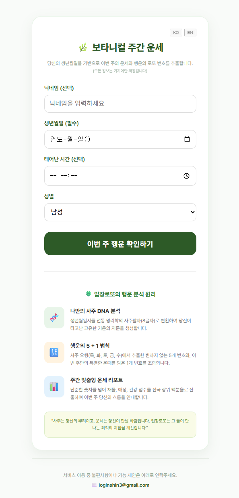
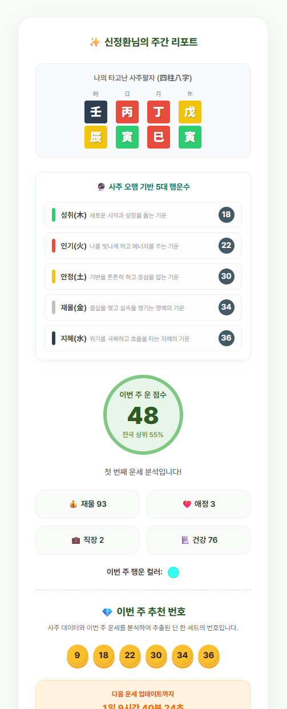

# 사주 로또 (SajuLotto)

> 당신의 사주팔자 기운을 담아 추천하는 맞춤형 로또 번호 생성기

사주 로또는 사용자의 생년월일시를 바탕으로 동양 철학의 사주 명리학 원리를 적용하여 행운의 번호를 추출해 주는 서비스입니다.

---

## 사주 기반 숫자 추출 알고리즘

사주 로또는 단순히 무작위 숫자를 생성하지 않습니다. 전통적인 사주 명리학의 **'오행(五行)' 수리**와 개인의 **사주 정보**를 결합한 독자적인 알고리즘을 사용합니다.

### 1. 사주 분석 (EightChar Analysis)
사용자가 입력한 양력 생년월일시 정보를 바탕으로 `lunar-typescript` 라이브러리를 통해 정확한 **사주팔자(8글자)**를 도출합니다.

### 2. 오행별 상징 숫자 (Five Elements & Numbers)
동양 철학에서 만물을 구성하는 다섯 가지 요소(목, 화, 토, 금, 수)는 각각 고유의 상징 숫자를 가집니다.
* 성취(木): 3, 8 계열 (새로운 시작과 성장의 기운)
* 인기(火): 2, 7 계열 (열정과 에너지를 주는 기운)
* 안정(土): 5, 10 계열 (기반을 튼튼히 하고 중심을 잡는 기운)
* 재물(金): 4, 9 계열 (결실을 맺고 실속을 챙기는 명예의 기운)
* 지혜(水): 1, 6 계열 (위기를 극복하고 흐름을 타는 지혜의 기운)

### 3. 개인 맞춤형 시드(Seed) 추출
동일한 날짜에 태어났더라도 태어난 시간에 따라 사주 구성이 달라집니다. 추출된 8글자의 유니코드 값을 합산하여 사용자만의 **고유 시드값**을 생성합니다.

### 4. 번호 선택 알고리즘
생성된 시드값을 바탕으로 각 오행의 후보군 중 가장 조화로운 번호를 하나씩(총 5개) 선택합니다.
- **수식:** `(시드값 + 오행 인덱스) % 후보군 길이`

---

## 주요 화면

### 랜딩 페이지
사용자의 생년월일과 태어난 시간을 입력받아 사주를 분석할 준비를 합니다.

### 결과 페이지

분석된 사주 오행 분포와 함께, 각 기운의 의미가 담긴 5개의 행운 번호를 제공합니다.

---

## 기술 스택
- **Framework:** React 18, Vite
- **Language:** TypeScript
- **Library:** `lunar-typescript` (사주/음양력 계산)
- **Styling:** Vanilla CSS
- **i18n:** react-i18next (한국어/영어 지원)
